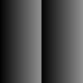
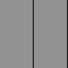

The goal is to create a shader each week, doesn't matter how simple or complex, as long as I keep going on. No AI, just documentation and tutorials. 

This time around I'll try and make a grid, inspired by the book of shaders https://thebookofshaders.com/edit.php#10/ikeda-simple-grid.frag

## What it does

- `gl_FragCoord.xy/u_resolution.xy` normalizes the pixel coordinates into the range [0.0-1.0]
- `fract(st * res)` return `st*res - floor(st*res)`, which basically creates this



- `step(t, grid.x)` and `step(t, grid.y)` returns 0 if grid.x || grid.y is < 0 and 1 if otherwise

 


```GLSL
precision mediump float;

uniform vec2 u_resolution;

float scale = 400.0;
float l_thickness = 0.01;

float grid(vec2 st, float res, float t){
    vec2 grid = fract(st * res);
    return 1.-(step(t,grid.x) * step(t,grid.y));    
}

void main() {
    vec2 st = gl_FragCoord.xy/u_resolution.xy;
    vec3 color = vec3(0.0);

    vec2 grid_scale = st*scale; // scale

    color += vec3(0.5725, 0.5725, 0.5725)*grid(grid_scale,0.04, l_thickness);

    gl_FragColor = vec4(color,1.0);
}
```


precision mediump float;

uniform vec2 u_resolution;

float scale = 400.0;
float l_thickness = 0.01;

float grid(vec2 st, float res, float t){
    vec2 grid = fract(st * res);
    return 1.-(step(t,grid.x) * step(t,grid.y));    
}

void main() {
    vec2 st = gl_FragCoord.xy/u_resolution.xy;
    vec3 color = vec3(0.0);

    vec2 grid_scale = st*scale; // scale

    color += vec3(0.5725, 0.5725, 0.5725)*grid(grid_scale,0.04, l_thickness);

    gl_FragColor = vec4(color,1.0);
}

